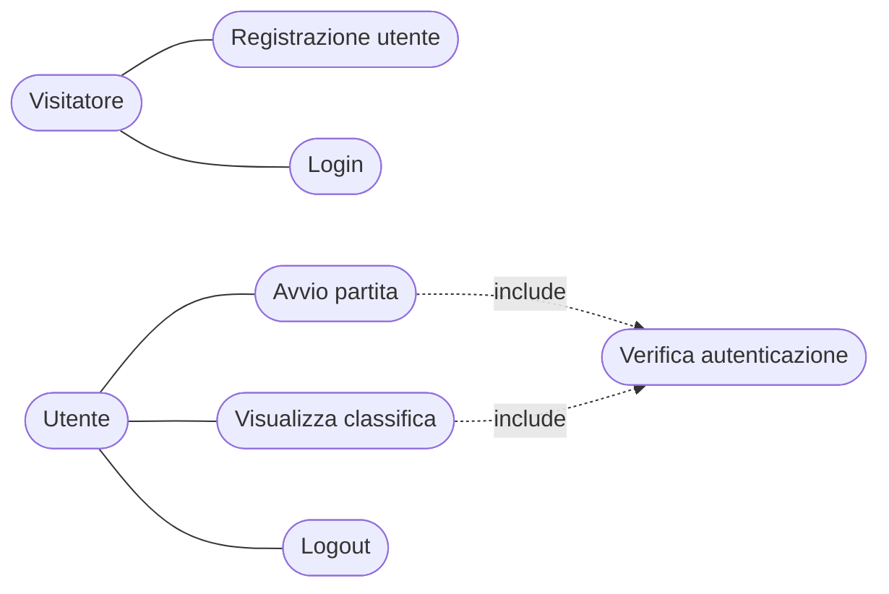
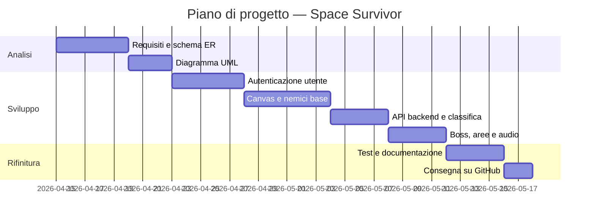

# Documento dei Requisiti — Space Survivor

## 1. Introduzione

### 1.1 Scopo del documento

Lo scopo di questo documento è:

- descrivere in modo chiaro il prodotto realizzato;
- raccogliere i requisiti funzionali e non funzionali;
- fornire una progettazione concettuale con schema ER, diagramma UML e casi d'uso organizzata nelle fasi di analisi, sviluppo e rifinitura;
- definire una roadmap di lavoro con milestone e attività principali.

### 1.2 Contesto

Il progetto è stato realizzato nell'ambito del modulo di Sviluppo Web e Database. Il software prevede:

- una gestione dati persistente tramite database relazionale SQLite;
- un sistema di autenticazione e sicurezza con hashing delle password;
- un'interfaccia web con visualizzazione dinamica tramite canvas HTML5;
- relazioni tra più tabelle nel database (utenti e punteggi);
- un'API REST per la comunicazione tra frontend e backend.

### 1.3 Tema del progetto

Tema scelto: **Space Survivor**.

Space Survivor è un videogioco browser-based di tipo *bullet hell*. Il giocatore pilota un'astronave che deve sopravvivere a ondate di nemici e boss progressivamente più difficili. Il gioco è accessibile solo agli utenti registrati e tiene traccia dei punteggi migliori in una classifica globale.

> Il gioco è costruito con **Phaser 3** per la logica del canvas e la **Web Audio API** per la sintesi audio procedurale, senza dipendenze esterne oltre a Flask e Phaser. Tutta la grafica è disegnata proceduralmente tramite `Phaser.Graphics`, senza alcun file immagine esterno.

---

## 2. Obiettivi generali

- Permettere a un utente di registrarsi e autenticarsi in modo sicuro.
- Avviare e giocare una partita di Space Survivor direttamente nel browser.
- Salvare automaticamente il punteggio migliore al termine di ogni partita.
- Visualizzare una classifica globale dei migliori giocatori aggiornata in tempo reale.
- Garantire che il gioco diventi progressivamente più difficile ad ogni boss sconfitto.

---

## 3. Stakeholder e attori

| Stakeholder | Ruolo | Interesse principale |
|---|---|---|
| Studente | Sviluppatore | Realizzare il progetto rispettando i requisiti tecnici e funzionali |
| Docente | Valutatore | Verificare correttezza tecnica, completezza e qualità del codice |
| Utente finale | Giocatore registrato | Giocare, migliorare il proprio punteggio e confrontarsi in classifica |

### Attori principali

- `Visitatore` — utente non autenticato, può accedere solo a login e registrazione
- `Utente autenticato` — giocatore registrato, può accedere al gioco e alla classifica

---

## 4. Requisiti funzionali

### 4.1 Requisiti principali

1. Registrazione di un nuovo account con username (3–20 caratteri) e password (minimo 6 caratteri).
2. Login con verifica delle credenziali e apertura della sessione Flask.
3. Logout con cancellazione della sessione.
4. Schermata di avvio con titolo, controlli e pulsante **Start Game** (attivabile anche con Invio o Spazio).
5. Movimento del giocatore in 8 direzioni con WASD o tasti freccia.
6. Sparo automatico a tripla direzione senza necessità di premere alcun tasto.
7. Tre tipi di nemici con comportamenti distinti: Drone, Spinner, Rusher.
8. Spawn automatico di un boss ogni 6 secondi dall'inizio di ogni area.
9. Progressione di difficoltà: HP, velocità e pattern di fuoco del boss aumentano ad ogni boss sconfitto.
10. Transizione di area di 2 secondi con overlay dopo la sconfitta del boss.
11. Sistema di power-up raccoglibili che ripristinano vite o aggiungono punti.
12. Salvataggio automatico del punteggio migliore per ogni utente al termine della partita.
13. Classifica globale visualizzata in tempo reale nella sidebar del gioco.
14. Riavvio della partita con tasto R dopo il game over.

### 4.2 User stories

- Come **visitatore**, voglio registrarmi con username e password per poter accedere al gioco e salvare i miei punteggi.
- Come **visitatore**, voglio accedere con le mie credenziali per ritrovare il mio punteggio precedente in classifica.
- Come **utente autenticato**, voglio vedere una schermata di avvio prima che il gioco inizi, per leggere i controlli e prepararmi.
- Come **giocatore**, voglio che la difficoltà aumenti ad ogni boss sconfitto, in modo che la sfida rimanga interessante nel tempo.
- Come **giocatore**, voglio che il boss abbia delle pause tra un attacco e l'altro, in modo che la partita sia impegnativa ma non impossibile.
- Come **giocatore**, voglio vedere il mio punteggio e quello degli altri nella sidebar, per sapere dove mi trovo in classifica.
- Come **utente autenticato**, voglio poter fare logout in qualsiasi momento dalla pagina di gioco.

---

## 5. Requisiti non funzionali

- L'interfaccia deve essere intuitiva: i controlli sono mostrati nella schermata di start e le statistiche sono visibili in tempo reale nella sidebar.
- Il login deve essere protetto con hashing delle password tramite Werkzeug.
- Il backend deve usare un database relazionale SQLite, creato automaticamente all'avvio con `init_db()`.
- Il codice deve essere organizzato in moduli distinti: `main.py` per il backend, `game.js` per la logica di gioco, `styles.css` per l'interfaccia.
- Deve essere possibile eseguire il progetto localmente con un ambiente virtuale Python e il comando `python run.py`.
- I dati devono essere persistenti tra una sessione e l'altra.
- Il gioco deve funzionare su Chrome e Firefox moderni.
---

## 6. Casi d'uso

### 6.1 Casi d'uso essenziali

1. `Registrazione utente`
2. `Login`
3. `Avvio partita`
4. `Gioca partita`
5. `Visualizza classifica`
6. `Logout`

### 6.2 Descrizione semplificata dei casi d'uso

- **Registrazione utente**: il visitatore inserisce username e password; il sistema valida i dati (lunghezza e unicità), crea l'account con password hashata e reindirizza al login.
- **Login**: l'utente inserisce username e password; il sistema verifica l'hash con Werkzeug e apre la sessione Flask. Reindirizza alla pagina di gioco.
- **Avvio partita**: l'utente autenticato vede la schermata di start con titolo e controlli. Preme "Start Game", Invio o Spazio per avviare la partita.
- **Gioca partita**: il giocatore muove la nave con WASD o frecce, evita i proiettili nemici e i boss. Il punteggio aumenta ad ogni nemico eliminato. Le vite diminuiscono ad ogni colpo ricevuto. Al game over il punteggio viene inviato automaticamente al backend.
- **Visualizza classifica**: la sidebar richiama `GET /api/leaderboard` all'avvio e dopo ogni partita, mostrando i migliori 8 punteggi con username.
- **Logout**: l'utente preme il pulsante Logout in alto a destra; la sessione viene cancellata e viene reindirizzato al login.

### 6.3 Relazioni tra casi d'uso: include ed extend

In un diagramma dei casi d'uso si usano due tipi di relazioni aggiuntive:

- `<<include>>`: rappresenta un comportamento obbligatorio riutilizzabile. Un caso d'uso base include un altro caso d'uso quando il suo comportamento è sempre eseguito.
- `<<extend>>`: rappresenta un comportamento opzionale o alternativo che si aggiunge al caso d'uso base solo in certe condizioni.

I casi d'uso non devono essere confusi con i rapporti tra attori. In questo progetto, `Utente autenticato` è un attore specializzato di `Visitatore`: può fare tutto ciò che può fare un visitatore, più le azioni protette (giocare, vedere la classifica, fare logout). Questo si modella con una generalizzazione tra attori, non con `include` o `extend`.

Le relazioni principali sono:

- `Avvio partita` <<include>> `Verifica autenticazione` — solo gli utenti loggati possono avviare il gioco; la route `/` reindirizza al login se la sessione non è attiva.
- `Visualizza classifica` <<include>> `Verifica autenticazione` — la pagina di gioco è protetta e la classifica è accessibile solo agli utenti autenticati.

### 6.4 Diagramma dei casi d'uso

---

## 7. Glossario dei termini

- `Bullet hell`: genere di videogioco in cui il giocatore deve schivare grandi quantità di proiettili nemici.
- `Boss`: nemico speciale con molti HP che appare ogni 6 secondi dall'inizio di ogni area. Diventa più difficile ad ogni sconfitta.
- `Area`: fase del gioco. Si avanza di area dopo aver sconfitto il boss, con una transizione di 2 secondi.
- `Power-up`: oggetto raccoglibile che appare casualmente dopo la morte di un nemico o boss. Ripristina una vita (se < 5) o aggiunge punti.
- `Upsert`: operazione sul database che aggiorna un record se esiste, o lo inserisce se non esiste. Usata per salvare il punteggio migliore.
- `Sessione Flask`: cookie firmato che mantiene lo stato di autenticazione dell'utente tra le richieste HTTP.
- `Web Audio API`: API browser per la sintesi audio procedurale. Usata per generare tutti i suoni di gioco senza file audio esterni.
- `Phaser 3`: framework JavaScript per giochi browser-based. Gestisce canvas, fisica arcade e ciclo di gioco.
- `Phaser.Graphics`: classe Phaser usata per disegnare forme geometriche direttamente su canvas, senza bisogno di file immagine.

---

## 8. Pianificazione e milestone

Questa sezione descrive la sequenza di lavoro del progetto, con tre fasi principali:

- **Analisi**: definire i requisiti, i casi d'uso e i modelli concettuali (ER, UML).
- **Sviluppo**: realizzare le funzionalità principali, l'interfaccia e la gestione dati.
- **Rifinitura**: testare, correggere i bug e preparare la consegna.

Nella fase di analisi si producono gli schemi ER e UML; questi documenti aiutano a progettare il database e le classi prima di scrivere il codice.

| Settimana | Fase | Attività principali |
|---|---|---|
| 1 | Analisi | Scelta tema, documento dei requisiti, schema ER, struttura Flask, preparazione ambiente virtuale |
| 2 | Sviluppo — Auth | Registrazione, login, logout, hashing password, protezione route, template HTML/CSS |
| 3 | Sviluppo — Gioco | Canvas Phaser 3, grafica procedurale, movimento, sparo, nemici base, collisioni |
| 4 | Sviluppo — Backend | API submit-score, leaderboard, sidebar DOM, Web Audio API, schermata di start |
| 5 | Rifinitura | Boss escalation, transizioni area, pause boss, testing, fix bug, README, consegna GitHub |

### 8.1 Gantt semplificato

