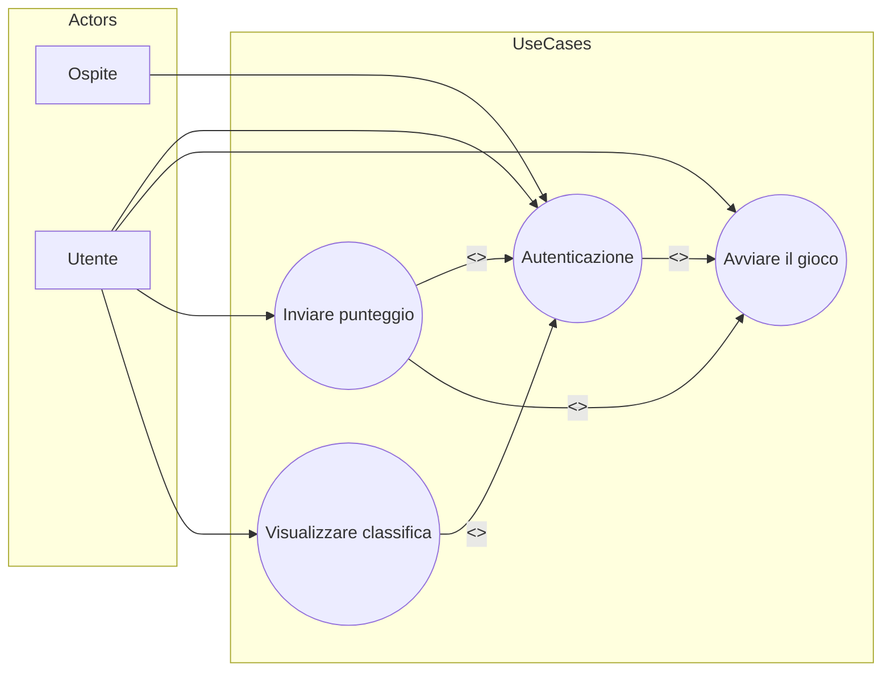

```mermaid
flowchart LR
    subgraph Actors
        Ospite[Ospite]
        Utente[Utente]
    end

    subgraph UseCases
        A((Autenticazione))
        B((Avviare il gioco))

        C((Inviare punteggio))
        D((Visualizzare classifica))
    end

    Ospite --> A

    Utente --> A
    Utente --> B
    Utente --> C
    Utente --> D


    D -->|<<include>>| A
    C -->|<<include>>| A
    C -->|<<include>>| B
    A -->|<<extend>>| B
```